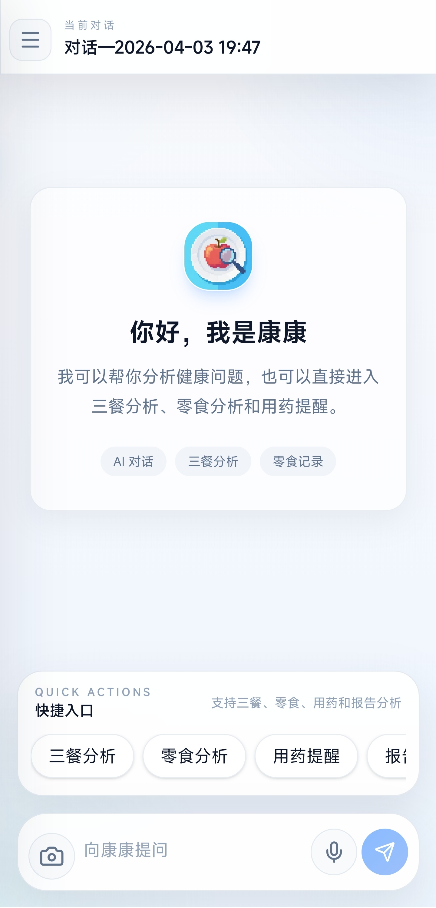

# 时康日记 前端

> 基于 Vue 3 + Vite + Capacitor 构建的健康管理前端，面向 Web 与 Android 双端使用，支持 AI 对话、三餐分析、零食分析、用药提醒、饮食日历和个人信息管理。

)

## 项目简介

这个项目是一个围绕“食物健康管理”场景打造的前端应用。它并不只是一个聊天界面，而是把健康对话、饮食记录、零食分析、用药计划和个人设置整合到同一套移动优先的界面中。


## 功能特性

- **AI 对话**：支持多轮会话、会话创建/删除、消息历史加载
- **三餐分析**：拍照上传早餐 / 午餐 / 晚餐图片并发起 AI 分析
- **零食分析**：记录饮品或袋装零食，提交数量与备注进行分析
- **用药提醒**：创建用药计划，并可同步到系统日历（Android）
- **三餐日历**：按月查看饮食记录，点击日期查看当天详情
- **个人设置**：修改用户名、疾病信息、忌口、头像与密码
- **移动端适配**：针对手机与 Android WebView 做了交互优化
- **Token 登录态**：登录后保存 token，接口自动携带认证头

## 技术栈

- **Vue 3**：前端框架
- **Vite**：开发与构建工具
- **Vue Router**：路由管理
- **Pinia**：状态管理
- **Axios**：HTTP 请求封装
- **Capacitor**：Android 原生容器能力
- **Vant**：移动端 UI 提示/交互
- **Tailwind CSS**：样式系统
- **lucide-vue-next**：图标库
- **markdown-it**：聊天与日历中的 Markdown 渲染

## 项目结构

```text
src/
├── api/                 # 接口封装（auth / conversation / message / meal / medicine）
├── components/          # 页面级与业务组件
├── router/              # 路由配置与登录拦截
├── store/               # Pinia 状态（user / sidebar）
├── styles/              # Android WebView 等额外样式
├── utils/               # 图片处理、消息标准化、加密、报告分析等工具
├── views/               # 页面视图（Home）
├── App.vue              # 根组件
└── main.js              # 入口文件
```

## 主要页面与路由

| 路由 | 页面 | 说明 |
| --- | --- | --- |
| `/` | `Home` | 主聊天页，左侧会话列表 + 右侧消息区 |
| `/login` | `Login` | 登录 / 注册 |
| `/food-record` | `FoodRecord` | 三餐分析 |
| `/snack-analysis` | `SnackAnalysis` | 零食分析 |
| `/medication-reminder` | `MedicationReminder` | 用药计划与日历提醒 |
| `/meal-calendar` | `MealCalendar` | 三餐记录日历 |
| `/settings` | `Settings` | 个人设置 |

## 运行要求

- Node.js：`^20.19.0 || >=22.12.0`
- npm：建议使用随 Node 安装的版本
- 后端服务：需要能访问 `API文档.md` 中定义的接口

## 本地开发

### 1）安装依赖

```bash
npm install
```

### 2）配置环境变量

建议在项目根目录创建：

- `.env.development`
- `.env.production`

推荐内容如下：

```dotenv
VITE_WEB_API_BASE_URL=/
VITE_NATIVE_API_BASE_URL=http://***:8080
VITE_API_PROXY_TARGET=http://***:8080
```

说明：

- Web 端默认使用 `VITE_WEB_API_BASE_URL`，通常为 `/`
- Android / Capacitor 端优先使用 `VITE_NATIVE_API_BASE_URL`
- Vite 本地开发代理目标由 `VITE_API_PROXY_TARGET` 控制

### 3）启动开发服务

```bash
npm run dev
```

### 4）打包预览

```bash
npm run build
npm run preview
```

## Android / Capacitor 构建

1. 先执行前端构建：

```bash
npm run build
```

2. 同步 Capacitor 资源：

```bash
npx cap sync android
```

3. 打开 Android 工程：

```bash
npx cap open android
```

或直接运行：

```bash
npx cap run android
```

> 提示：`capacitor.config.json` 已开启 `cleartext`，并允许原生容器内访问外部后端地址，适合当前 HTTP 后端环境。

## 登录与鉴权说明

- 登录 / 注册接口使用邮箱 + 密码
- 前端在提交前会对密码做加密处理（`src/utils/encrypt.js`）
- 登录成功后，token 会保存到 `localStorage`
- `src/api/http.js` 会自动为除登录 / 注册外的请求添加 `Authorization: Bearer <token>`
- 如果接口返回 `401`，前端会自动清除 token 并跳回登录页

## 接口概览

### 认证接口

- `POST /api/auth/login`
- `POST /api/auth/register`
- `GET /api/auth/info`
- `POST /api/auth/setting`
- `POST /api/auth/setting/change`

### 会话与消息

- `POST /api/ai/conversation/create`
- `GET /api/ai/conversation/list`
- `DELETE /api/ai/conversation/delete`
- `POST /api/ai/message/send`
- `GET /api/ai/message/list`

### 三餐日历

- `GET /api/meal/month`
- `GET /api/meal/day`

### 用药记录

- `POST /api/medicine/send`

更多字段说明和返回结构，请参考 `API文档.md`。

## 重要实现细节

- `Home.vue` 会根据屏幕宽度自动决定侧边栏展开状态
- Android WebView 下对双击缩放、滚动和触摸交互做了额外处理
- `src/utils/messageNormalization.js` 用于兼容不同消息返回结构
- `src/utils/helper.js` 负责图片压缩、Base64 转换
- `src/utils/reportAnalysis.js` 已预留“报告分析”流程，可复用到后续功能入口

## 常见问题

### 1. 进入页面后又跳回登录页

通常是 token 失效、格式不正确，或后端返回了 `401`。请检查 `localStorage` 中的 token 和后端登录状态。

### 2. Web 端接口请求失败

确认本地开发时是否正确设置了 `VITE_API_PROXY_TARGET`，并且后端服务可访问。

### 3. Android 端请求打到了 `localhost`

请检查 `.env.production` 中的 `VITE_NATIVE_API_BASE_URL`，原生端不要留空。

### 4. 图片上传失败

请确认后端支持 Base64 图片接收，并检查图片大小是否过大。

## 参考文档

- `API文档.md`：完整接口说明
- `capacitor.config.json`：Capacitor 配置
- `vite.config.js`：Vite 开发代理配置

## 许可证

未单独声明许可证时，请按项目实际情况使用。
